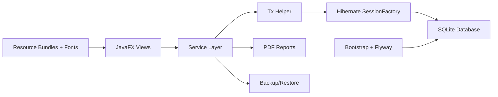

# MilkDiary

MilkDiary is a desktop milk collection and billing system built for small dairy outlets. It manages outlets, members, daily milk entries, species-specific rate plans, monthly bills, savings deductions, cap locks, backups, and PDF reports from a single JavaFX application.

The project is written as a practical business application rather than a demo CRUD app: it includes local persistence, schema migrations, billing calculations, audit logging, Marathi UI strings, and operational backup/restore flows.

## Highlights

- JavaFX desktop UI with outlet, member, daily entry, billing, savings, summary, and settings screens
- SQLite database with Flyway migrations for local-first usage
- Hibernate/JPA service layer with transaction helpers
- Rate plan engine for cow/buffalo milk pricing by fat/SNF criteria
- Monthly bill generation with savings deductions, adjustments, round-off, and lock handling
- PDF bill/report generation with Devanagari font support
- Backup and restore workflow for field/operator use
- English and Marathi resource bundles

## Tech Stack

| Area | Technology |
| --- | --- |
| UI | JavaFX 23 |
| Language | Java 23 |
| Persistence | Hibernate 6, Jakarta Persistence |
| Database | SQLite |
| Migrations | Flyway |
| Connection Pool | HikariCP |
| PDF | OpenPDF |
| Build | Gradle Kotlin DSL |

## Screens And Modules

- Daily Entries: capture milk quantity, fat, SNF, session, and computed amount
- Members: maintain supplier/member records by outlet
- Rate Plans: configure effective pricing slabs
- Monthly Billing: generate bills, apply adjustments, lock bills
- Savings: track period-based member savings
- Outlet Summary: view operational totals and export summaries
- Settings: language, backup path, admin options, report metadata

## Architecture



See [docs/ARCHITECTURE.md](docs/ARCHITECTURE.md) for the detailed package and data-flow notes.

## Getting Started

### Prerequisites

- JDK 23
- Git

The Gradle wrapper is included, so a separate Gradle installation is not required.

### Run The App

```bash
./gradlew :app:run
```

On Windows:

```bat
gradlew.bat :app:run
```

The app creates and uses a local SQLite database at:

```text
app/data/milkdiary.db
```

### Run Verification

```bash
./gradlew :app:test
```

Current note: the Gradle test task is wired, but the repository still needs proper `src/test/java` test coverage.

## Repository Layout

```text
app/src/main/java/com/rudrainfotech/milkdiary
  db/          Hibernate and property loading
  entity/      JPA entities and enums
  i18n/        Locale bootstrap
  report/      PDF report generation
  service/     Business logic and transactions
  ui/          JavaFX screens and dialogs
app/src/main/resources
  db/migration Flyway SQL migrations
  i18n/        English and Marathi strings
  fonts/       Devanagari fonts for UI/PDF support
docs/          Portfolio documentation
```

## Portfolio Case Study

The short product and engineering case study is available at [docs/CASE_STUDY.md](docs/CASE_STUDY.md).

## Roadmap

See [docs/ROADMAP.md](docs/ROADMAP.md) for the most useful next improvements, including test coverage, migration hardening, and packaging.

## Author

Vishwambhar Patil  
GitHub: [vishuavi777-eng](https://github.com/vishuavi777-eng)

## License

This project is available under the MIT License. See [LICENSE](LICENSE).
