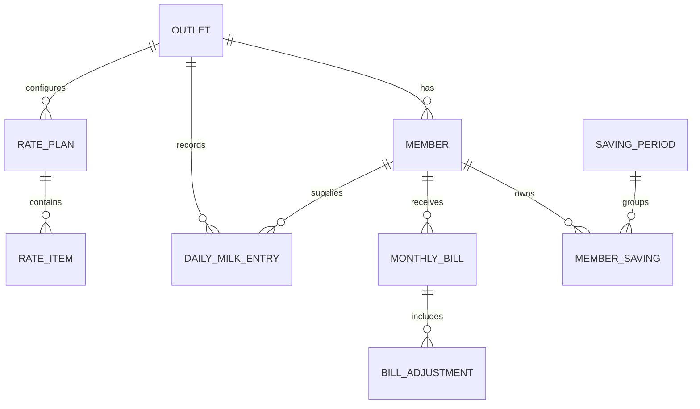
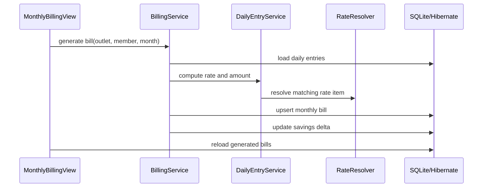

# Architecture

MilkDiary is a local-first JavaFX desktop application. It keeps the operator workflow simple while isolating persistence, billing, and reporting concerns into separate packages.

## Runtime Flow

1. `MainApp` starts the JavaFX application.
2. `Bootstrap` creates the data directory, applies pending restore files, runs Flyway migrations, seeds default records, and validates the active outlet setting.
3. `AppShell` initializes locale/font support and hosts navigation.
4. JavaFX views call service classes for business operations.
5. Services use `Tx` to run Hibernate work against SQLite.
6. Reports and backups are generated from service/database state.

## Package Responsibilities

| Package | Responsibility |
| --- | --- |
| `db` | Application properties, Hibernate `SessionFactory`, SQLite connection setup |
| `entity` | JPA mapped domain objects such as outlets, members, entries, bills, rates, savings |
| `service` | Business workflows, transactions, billing, savings, lock checks, backups |
| `ui` | JavaFX screens, dialogs, navigation, table editing, operator actions |
| `report` | PDF bill and cap report generation |
| `i18n` | Locale initialization and resource lookup |

## Main Domain Model

## Billing Flow

## Data And Migrations

The app uses SQLite for a low-friction desktop deployment. Flyway migrations live in `app/src/main/resources/db/migration` and create the schema incrementally.

Important operational data lives under `app/data` during local development. In a production packaging pass, the database path should be moved to an OS-specific application data directory.

## Cross-Cutting Concerns

- Transactions: service methods wrap database work through `Tx`.
- Localization: UI labels are loaded from resource bundles and Devanagari fonts are bundled.
- Auditability: sensitive operations such as backup, restore, cap locking, and daily entry changes are logged.
- Reporting: PDF generation uses OpenPDF and bundled fonts.
- Backup: SQLite backups are generated through application settings and retained by count.

## Known Technical Debt

- Add real tests under `app/src/test/java`.
- Harden SQLite foreign-key initialization and migration validation before production distribution.
- Move mutable runtime files out of the repository tree.
- Package the app with `jlink`/`jpackage` for non-developer installation.
